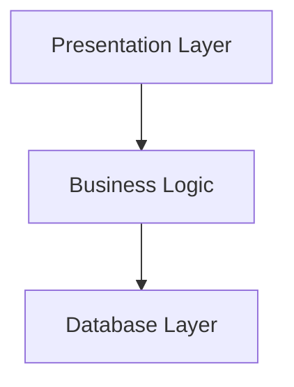

### Table of contents
- [Intro](#intro)
  - [Encapsulation and Abstraction](#encapsulation-and-abstraction)
    - [Encapsulation](#encapsulation)
    - [Abstractions and ABCs](#abstractions-and-abcs)
    - [Layering](#layering)
    - [Three-Layered-Architecture](#three-layered-architecture)
  - [Dependency Inversion Principle](#dependency-inversion-principle)
  - [Domain Model](#domain-model)
TDD
: Test-Driven Development
: Enables us to refactor, add features without fear of regression.
: How to get as much feedback from fast, *dependency-free unit tests* and have minimum number of *end-to-end tests*.

DDD
: Domain-Driven Design
: Focused on building business domain.
: How to not overload and don't becaome hard to change because of the use of may infastructures and high-level API.

EDA
: Even-Driven Architecture

Loosely coupled (micro)services
: AKA reactive microservices
: Well-established answer to managing complexity across mulitple applications or business domains.
: Flask, Django, Celery etc.

OO
: Object-Oriented
: Classic characterization is RDD

RDD
: Responsibility-Oriven Design
: Uses *roles* and *responsibilities* rather than *tasks*.
: To think about code in terms of behavior, rather than in terms of data or algorithms.

ABC
: Abstract Base Class
: Interface to define and abstraction.
: "Public API"
: Choose between ABC or Duck-Typing

DIP
: Dependency Inversion Principle

# Intro
Chaos characterized by homogeneity; Order, by complexity.
: Evolving garden analogy.

: real-life dependency diagram (source: "Enterprise Dependency: Big Ball of Yarn" by Alex Papadimoulis)

## Encapsulation and Abstraction
### Encapsulation
1. Simplifying behavior
2. Hiding data

We encapsulate behavior by identifying  a task that needs to be done in our code and giving a task to a well-defined object or function. We call that object or function an *abstraction*.

### Abstractions and ABCs
In traditional OO language like Java or C#, you might use an abstract base class (ABC) or an interface to defiene an abstraction.

### Layering
Helps us by hiding details and protecting the consistency of our data.

### Three-Layered-Architecture

Layered architecture is perhaps the most common pattern for business software.

1. Pesentation: UI, wepage, API, command line, communicates with
2. Business logic layer that contain business rules and workflows.
3. Database is responsible for storing and retrieving data.

## Dependency Inversion Principle
Formal definition
: High-level modules should not depend on low-level modules. Both should depend on abastractions. 
: Abstraction shoud not depend on details. Instead, details should depend on abstractions.

**High-level modules** are the code everyon really cares about.
- Should be easy to change in response to business needs.

**Low-level modules** are codes no one cares about. Unlikely that your HR department gets excited about file-systems or network sockets. You don't discuss SMTP, HTTP, or AMQP with your finance team. Irrelevent to our stakeholders.
- *Details* are often harder to change. Refactoring vs. defining, testing, and deploying a database migration to change column name.

*Depends on* does not mean *import* or *calls*, but rather a more general idea that one module *knows about* or *needs* another module.

## Domain Model
