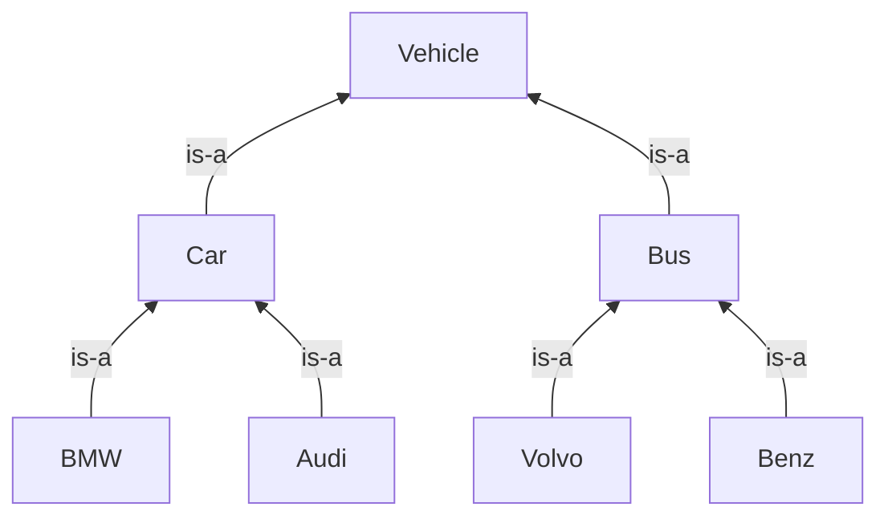

# Class
```
class Patient:
    def __init__(self, idp, name, ssn):
        self.idp = idp
        self.name = name
        self.ssn = ssn


ent_1 = Patient(124, "Andro", 4327897)
print("name is {0}, id is {1}, and ssn is {2}".format(
    ent_1.name, ent_1.idp, ent_1.ssn))
```
## Inheritance

### Cars
```
class BMW:
    def __init__(self, make, model, year):
        self.make = make
        self.model = model
        self.year = year


class ThreeSeries(BMW):

    def __init__(self, cruisControlEnabled, make, model, year):
        BMW.__init__(self, make, model, year)
        self.cruisControlEnabled = cruisControlEnabled


class FiveSeries(BMW):

    def __init__(self, parkingAssistEnabled, make, model, year):
        BMW.__init__(self, make, model, year)
        self.parkingAssistEnabled = parkingAssistEnabled


threeSeries = ThreeSeries(True, 'BMW', '328i', '2018')
print(threeSeries.cruisControlEnabled)
```