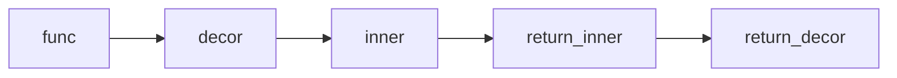

# Decorator
```
def decor(fun):
    def inner():
        result = fun()
        return result*2
    return inner

def num():
    return 5

resultfun = decor(num)
print(resultfun())
```


## same results
```
@decor
def num():
    return 5
print(num())
```

## hello
```
def decor(fun):
    print(type(fun))

    def inner(x):
        print(type(x))
        result = fun(x)
        print(type(fun))
        result += ", how are you?"
        print(type(result))
        return result
    print(type(inner))
    return inner


def hello(name):
    return "Hello "+name


print(hello('Andro'))
```