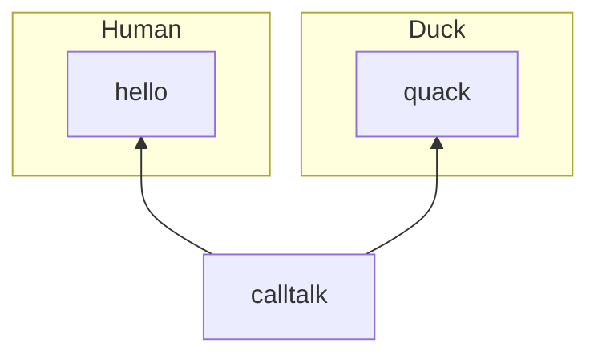
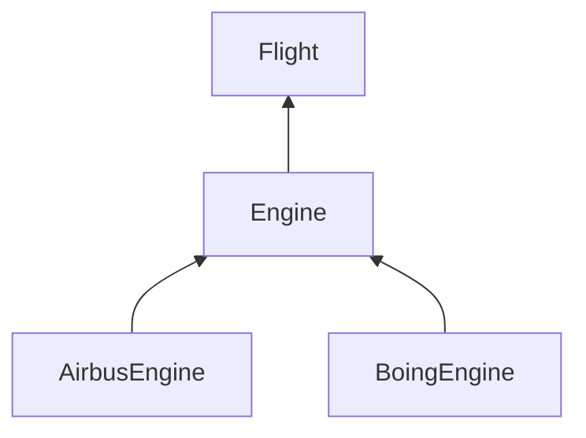

# Polymorphism
1. Duck Typing
2. Dependency Injection
3. Method Overriding

## Duck Typing
```
def callTalk(obj):
    obj.talk()
```

## Demo
```
class Duck:
    def talk(self):
        print("Quack")


class Human:
    def talk(self):
        print("Hello")


def callTalk(obj):
    obj.talk()


d = Duck()
callTalk(d)

h = Human()
callTSalk(h)
```
## Dependency Injection

Injecting ang object into another object.