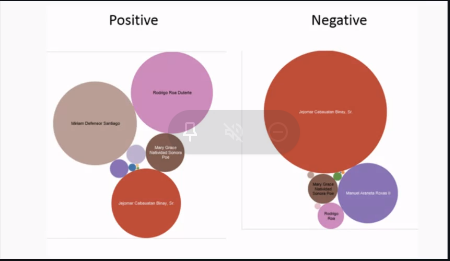
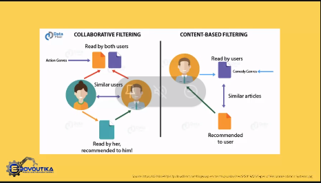
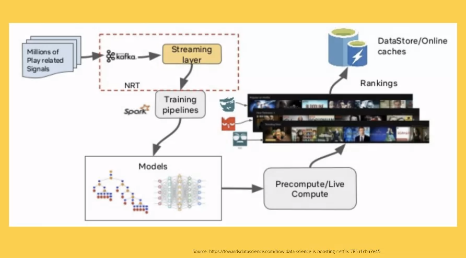
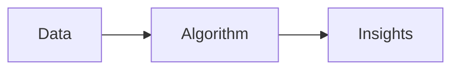
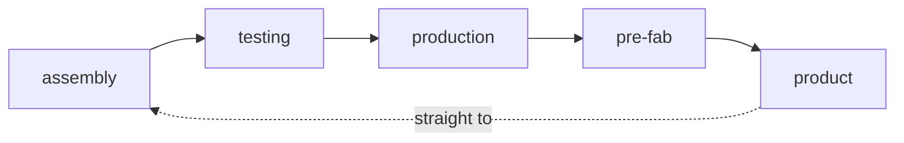

# Fundamentals of Data Science
Robert Lue Astruias, ECE, MTM CLSSGB
Rhonnel Paculanan

## Topics
- [Fundamentals of Data Science](#fundamentals-of-data-science)
  - [Topics](#topics)
  - [Questions to answer by Data Science](#questions-to-answer-by-data-science)
    - ["What product shoul I put on Eat Bulaga?"](#what-product-shoul-i-put-on-eat-bulaga)
    - [What strategies should I need to place in order for my cadidate to gain more votes after the electroal debate?](#what-strategies-should-i-need-to-place-in-order-for-my-cadidate-to-gain-more-votes-after-the-electroal-debate)
    - [Netflix match](#netflix-match)
      - [Collaborative Filtering](#collaborative-filtering)
      - [Content-Based Filtering](#content-based-filtering)
  - [Policies](#policies)
    - [What policies/strategies should I need to implement to control the spread of COVID-19](#what-policiesstrategies-should-i-need-to-implement-to-control-the-spread-of-covid-19)
    - [Time-varying reproduction number, Rt](#time-varying-reproduction-number-rt)
    - [What is data science?](#what-is-data-science)
  - [Sources of Data](#sources-of-data)
    - [Algorithms](#algorithms)
    - [Exploratory Data Analysis](#exploratory-data-analysis)
    - [Data Science Toolbox](#data-science-toolbox)
      - [Storage](#storage)
      - [Convert & ETL](#convert--etl)
      - [Transform](#transform)
      - [Exploratory Analysis](#exploratory-analysis)
      - [Model Build & Generating Isnights](#model-build--generating-isnights)
      - [Visualization](#visualization)
      - [Model Execution in Production](#model-execution-in-production)

## Questions to answer by Data Science
### "What product shoul I put on Eat Bulaga?"

If you're a business manager, the coverage of the phenomna(Aldub 2015) you want to know?

How many information has been collected?
Social graph
: *Impressions* refer to estimate number of people have seen the hastage on their twitter feed.

- Will give you an idea to how visible is your product.

### What strategies should I need to place in order for my cadidate to gain more votes after the electroal debate?
1. What basis of strategy for this political manager?
2. Sentiment Analysis
   - How many positive sentiments during a certain period (bubble diagram)
    
    - Sentiments are *Unstructured data* (cannot put in a table)
    - Helps us identify these data.
3. How can I make my customers/users fully engaged on my application?
    - Engagement must be continuous.

> If the Startbucks secret is a smile when you get your latte...ours is that the Website adapts to the individual's taste." -Reed Hastings (CEO of Netflix)

### Netflix match
In a film, there's a percentage value of match in your interests.



Feed to people recommendations
#### Collaborative Filtering
1. Identify the person who whatch action films
2. Recommend to another user who wants action film

#### Content-Based Filtering
1. Identify frequently watched films with a specific genre.
2. Recommend films under the similar genre.



**Based your recommendations on the taste of your audience**

- Netflix will analyze everything.
  - if you stop on an episode, they will ask why?
  - they will base on those data
  
Data scientist does:
- Understading behavior
- Improving user experience

## Policies
Public Admins
### What policies/strategies should I need to implement to control the spread of COVID-19

- Dapat ba GCQ na ba? MCQ na? or ECQ?
  - follow up: saan? buong pilipinas ba? metro manila ba?

### Time-varying reproduction number, Rt

$$Rt \leq 1$$

### What is data science?
> The science of extracting knowledge from data to support sound and data-driven decisions.

> *Infobsesity* is too much useless information.

## Sources of Data
**Big Data**
1.  Archives - scanned docs, statements, insurance forms, record organizations and their customers.
2.  Documents - different file formats, word, xml, json, csv
3.  Media - images, videos, podcast, live-streams, audio, flash
4.  Data Storage - sql, doc repository houses
5.  Business Apps - erp, production, inventory, demographics, expense management, procurement
6.  Public Web - government, competitivem traffic, satellite systems, waze, grab
7.  Social Media - trendlist from twitter
8.  Machine Log Data - .dat .log files 
9.  Sensor Data


### Algorithms
- Correlation analysis 
- Regression analysis



### Exploratory Data Analysis
Process of visualizing and analyzing data to extract insights form it.

```mermaid
graph LR
1[Data]
2[EDA]
3[Quesstions]
4[EDA]
5[]
6[]
1-->2
```

### Data Science Toolbox
#### Storage
1. mongoDB
2. SAP
#### Convert & ETL
#### Transform
#### Exploratory Analysis
1. elastisearch
2. Knime
#### Model Build & Generating Isnights
1. R
2. SAS
3. SPSS
4. Julia
5. Revolution
#### Visualization
1. Tableau
2. SAP
#### Model Execution in Production
1. Java
2. Hadoop
3. C#
4. Storm
5. Spark
6. Skala